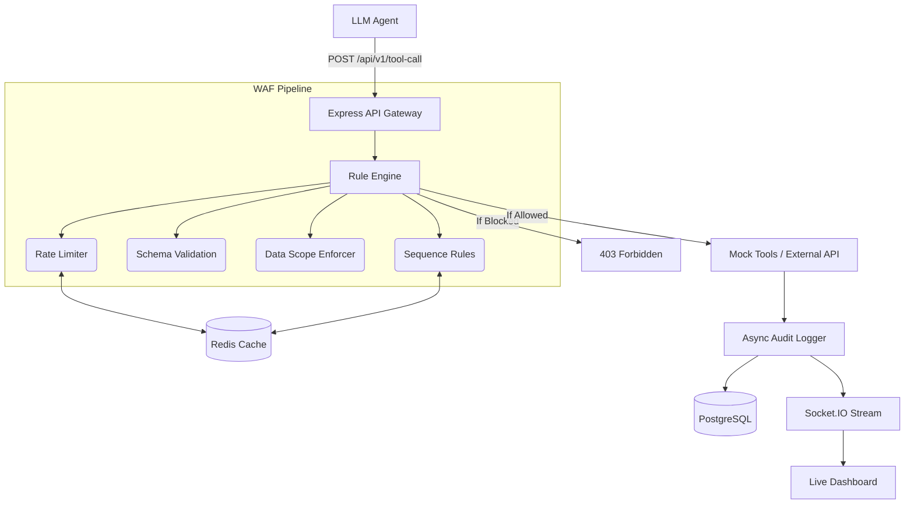
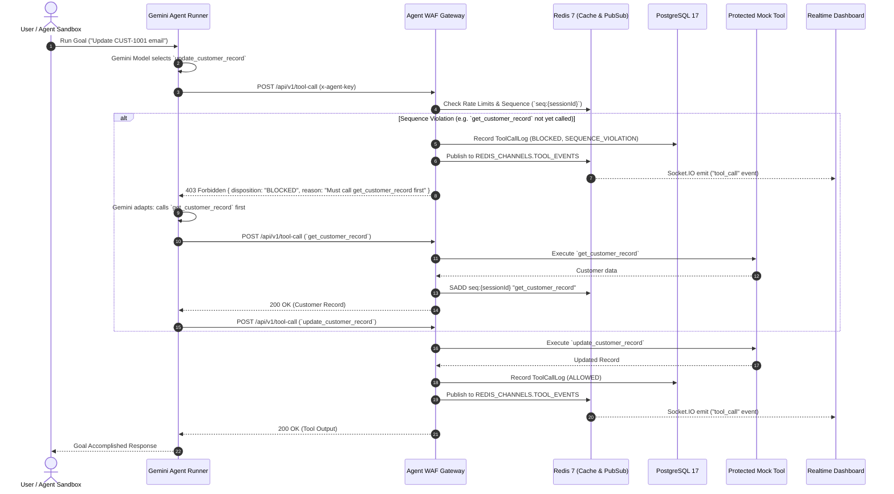

# Agent WAF — Policy-Enforcing Proxy for AI Agent Tool Invocations

[](https://nodejs.org)
[](https://www.typescriptlang.org/)
[](https://www.prisma.io/)

> **Agent WAF** is a high-performance, enterprise-grade security gateway and policy enforcement firewall that sits between autonomous AI agents and execution environments. It inspects, validates, filters, sanitizes, and logs every tool invocation in real time before execution.

---

## Table of Contents

- [1. Problem Statement & Architecture](#1-problem-statement--architecture)
- [2. High-Level Design (HLD)](#2-high-level-design-hld)
- [3. Core Features & Capabilities](#3-core-features--capabilities)
- [4. Rule Engine & Policy Specifications](#4-rule-engine--policy-specifications)
- [5. Real-Time Dashboard & Telemetry](#5-real-time-dashboard--telemetry)
- [6. Production Readiness & Enterprise Security](#6-production-readiness--enterprise-security)
- [7. System Flow & Sequence Diagram](#7-system-flow--sequence-diagram)
- [8. API Reference](#8-api-reference)
- [9. Local Development & Verification](#9-local-development--verification)
- [10. Project Structure](#10-project-structure)

---

## 1. Problem Statement & Architecture

### The Security Gap in Autonomous AI Agents

Traditional Web Application Firewalls (WAFs) inspect incoming HTTP requests from the open internet before reaching web servers. However, **in modern Agentic AI workflows, autonomous agents (powered by LLMs like Gemini, Claude, GPT-4) generate tool calls dynamically**.

Without an enforcement layer:

1. **Prompt Injections & Jailbreaks** can cause agents to call privileged tools (e.g. `delete_customer_record` or `export_report`).
2. **Data Scope Violations** allow agents to access records across tenant boundaries.
3. **Execution Denial of Service (DoS)** occurs when agents enter infinite loops calling high-cost APIs.
4. **Sequence Violations** occur when destructive tools are invoked without preceding read/approval checks.

```
┌─────────────────┐       Tool Call Request        ┌───────────────────────┐
│ Autonomous Agent│ ─────────────────────────────> │       AGENT WAF       │
│ (Google Gemini) │                                │  (Inspection Engine)  │
└─────────────────┘                                └───────────┬───────────┘
                                                               │
                                         ┌─────────────────────┴─────────────────────┐
                                         │ Evaluates:                                │
                                         │  1. Rate Limits (Atomic Redis)           │
                                         │  2. SQLi / Script Blocklists             │
                                         │  3. Payload Size Constraints             │
                                         │  4. Agent Data Scope Boundaries          │
                                         │  5. Session Tool Call Sequences          │
                                         │  6. Shadow Mode Calibration              │
                                         └─────────────────────┬─────────────────────┘
                                                               │
                                   ┌───────────────────────────┴───────────────────────────┐
                                   ▼                                                       ▼
                            [ BLOCKED / 403 ]                                     [ ALLOWED / 200 ]
                     Returns structured policy error                          Executes Mock / Target Tool
                     to Agent for adaptive recovery                            Logs to PostgreSQL & Streams
                                                                               Realtime Events via Socket.IO
```

---

## 2. High-Level Design (HLD)

Agent WAF operates as a fast, transparent gateway between the LLM and its execution tools.
When an Agent attempts to call a tool, the invocation is POSTed to the WAF. The WAF routes the payload through a pipeline of evaluators (Rate Limit, Parameter Blocklist, Data Scope, Sequence). 
State is maintained atomically in Redis (for rate limit windows and session sequences) while persistent audit logs are written to PostgreSQL asynchronously.



---

## 3. Core Features & Capabilities

- **Transparent Proxy Gateway**: Intercepts `POST /api/v1/tool-call` with agent bcrypt authentication, Zod schema validation, and front-door Redis rate limiting.
- **5 Multi-Layer Policy Evaluators**:
  1. **Rate Limiting**: Rolling window counters evaluated atomically in Redis (`INCR` + `EXPIRE`).
  2. **Parameter Blocklist & Injection Detection**: Regex checks for SQL injection (`OR 1=1`, `UNION SELECT`, `; DROP TABLE`), script tags, and path traversal.
  3. **Parameter Size Limit**: Guards against payload stuffing and buffer overruns.
  4. **Data Scope Enforcement**: Restricts access based on dynamic regex patterns declared on the agent record (e.g. tenant-isolated `^CUST-1`).
  5. **Sequence Rules**: Enforces strict invocation order (e.g. requiring `get_customer_record` in the current session before allowing `update_customer_record` or `delete_customer_record`).
- **Bonus Feature: Shadow Mode Calibration**:
  - Rules can run in `SHADOW` mode. Violations are logged with disposition `SHADOW_BLOCKED` and broadcast to the dashboard, but the execution is allowed through to test new policies without interrupting production agent workloads.
- **Real-Time Glassmorphic Dashboard**:
  - Live tool call event stream connected over Socket.IO and Redis Pub/Sub.
  - KPI counters: Total Calls, Block Rate %, Shadow Blocks, and Clean Calls.
  - Interactive Gemini Agent Sandbox with canned scenarios (Sequence Recovery, Blocklist Catch, Scope Boundary, Rate Limiter).
  - Inline Rule Editor with live `BLOCK` $\leftrightarrow$ `SHADOW` and active status toggles.
  - Audit Logs Explorer with search, disposition filtering, and slide-over JSON inspector.
- **Enterprise-Grade Parameter Sanitization**:
  - Sensitive parameters are redacted (`[REDACTED]`) and long inputs truncated to 200 characters before persisting to Postgres or emitting over websockets to prevent credential leakage.

---

## 4. Rule Engine & Policy Specifications

| Rule Type          | Config Schema                                           | Failure Code           | Behavior                                                                                       |
| :----------------- | :------------------------------------------------------ | :--------------------- | :--------------------------------------------------------------------------------------------- |
| `RATE_LIMIT`       | `{ maxCalls: 5, windowSeconds: 60 }`                    | `RATE_LIMIT_EXCEEDED`  | Tracks calls via Redis key `ratelimit:{agentId}:{tool}:{window}`. Blocks call 6+ within 60s.   |
| `PARAM_BLOCKLIST`  | `{ param: "query", pattern: "(?i)(union.*select...)" }` | `BLOCKED_PARAM_VALUE`  | Evaluates regex against target param. Automatically redacts malicious payloads in audit logs.  |
| `PARAM_SIZE_LIMIT` | `{ param: "body", maxBytes: 500 }`                      | `PARAM_SIZE_EXCEEDED`  | Rejects payloads exceeding character length limit.                                             |
| `DATA_SCOPE`       | `{ param: "customerId", pattern: "^CUST-1" }`           | `DATA_SCOPE_VIOLATION` | Compares param value against agent's `declaredScope.allowedCustomerIdPattern`.                 |
| `SEQUENCE`         | `{ requiredPriorTool: "get_customer_record" }`          | `SEQUENCE_VIOLATION`   | Checks Redis set `seq:{sessionId}`. Blocks if prior required tool was not executed in session. |

---

## 5. Real-Time Dashboard & Telemetry

The frontend application (`apps/frontend`) is built with React 19, Tailwind CSS, Lucide icons, and Recharts:

1. **Authentication**: Powered by `better-auth` with a 1-click **Quick Login (Demo Admin)** button for instant evaluator access.
2. **Live Feed**: Subscribes to Socket.IO `/dashboard` namespace on the `tool_call` event.
3. **Agent Sandbox**: Allows executing dynamic natural language goals directly against real Google Gemini models (`gemini-2.5-flash` or custom `GEMINI_MODEL`) to observe real-time WAF interceptions.

---

## 6. Production Readiness & Enterprise Security

- **Real LLM Integration**: Uses official `@google/genai` SDK with autonomous multi-turn tool calling and error feedback loops.
- **High Concurrency & Atomic State**: Uses Redis for sequence sets, rate-limiting windows, and pub/sub events to ensure stateless scaling across multiple backend instances.
- **Prisma 7 ESM**: Leverages modern `@prisma/adapter-pg` driver adapters with type-safe migrations and structured schemas.
- **Observability & Logging**: High-performance structured JSON logging with `pino` (`requestId`, latency in ms, HTTP method, client IP, agent ID, and disposition).
- **Health Checks**: Deep readiness endpoint (`GET /healthz`) probing PostgreSQL query latency and Redis ping responses.

---

## 7. System Flow & Sequence Diagram



---

## 8. API Reference

### 1. Gateway Tool Invocation

The core proxy endpoint where AI agents send their tool execution requests.

- **`POST /api/v1/tool-call`**
  - **Headers**: `x-agent-key: <RAW_AGENT_KEY>`, `x-session-id: <SESSION_UUID>`
  - **Body Example**:
    ```json
    {
      "tool": "get_customer_record",
      "parameters": { "customerId": "CUST-1001" }
    }
    ```
  - **Response (200 OK - ALLOWED)**:
    ```json
    {
      "disposition": "ALLOWED",
      "result": { "id": "CUST-1001", "name": "Jane Doe", "tier": "ENTERPRISE" },
      "latencyMs": 14,
      "evaluatedRules": [
        { "ruleId": "r-01", "ruleName": "Rate Limit", "passed": true }
      ]
    }
    ```
  - **Response (403 Forbidden - BLOCKED)**:
    ```json
    {
      "disposition": "BLOCKED",
      "blockedByRule": { "id": "r-05", "name": "Enforce Read Before Write", "type": "SEQUENCE" },
      "reason": "Tool 'update_customer_record' requires prior execution of 'get_customer_record' in this session.",
      "latencyMs": 8
    }
    ```

### 2. Autonomous Agent Runner

- **`POST /api/v1/agent-run`**: Triggers a live, server-side Gemini agent to execute a goal autonomously. The backend uses the official `@google/genai` SDK to spawn an agent that iteratively calls tools via the gateway until the goal is achieved. This is primarily used by the Sandbox UI for demonstration purposes.

### 3. Admin & Configuration API

_Note: All `/api/admin/*` routes require an active Better-Auth session cookie._

**Agents Management**
- **`GET /api/admin/agents`**: Returns a list of all registered AI agents, including their configured data scopes and tool access permissions.
- **`POST /api/admin/agents`**: Registers a new AI agent and generates a unique `x-agent-key` that the agent must use to authenticate its tool calls.
- **`PATCH /api/admin/agents/:id`**: Updates an existing agent's configuration, such as changing its allowed customer ID patterns or modifying which tools it is authorized to invoke.
- **`DELETE /api/admin/agents/:id`**: Instantly revokes an agent's access and deletes it from the system. Any active sessions using this agent's key will immediately fail.

**Firewall Rules Management**
- **`GET /api/admin/rules`**: Returns the complete set of active WAF policies (Rate Limits, Data Scopes, Sequences, Blocklists) that are currently enforcing tool execution behavior.
- **`POST /api/admin/rules`**: Creates and deploys a new policy evaluator to the WAF engine in real-time.
- **`PATCH /api/admin/rules/:id`**: Updates a rule's configuration parameters or toggles its `mode` (e.g., switching a rule from `BLOCK` to `SHADOW` mode to observe its effects without actually failing requests).
- **`DELETE /api/admin/rules/:id`**: Removes a policy rule from the evaluation chain.

**Telemetry & Logging**
- **`GET /api/admin/logs`**: Retrieves a paginated, chronological audit trail of all `ToolCallLog` events, detailing the exact agent, tool, parameters, and WAF disposition (ALLOWED/BLOCKED) for every execution.
- **`GET /api/admin/stats/summary`**: Aggregates high-level KPI metrics for the Dashboard, such as the total number of tool calls processed, the overall block rate, and the most active agents.
- **`GET /api/admin/diagnostics`**: Fetches deep diagnostic telemetry, including individual rule evaluation latencies, Redis pub/sub health, and database connection statuses.

### 4. System Endpoints

- **`POST /api/auth/*`**: Standard [Better-Auth](https://better-auth.com) endpoints (e.g., `/sign-in`, `/sign-out`, `/session`) used to manage administrator authentication and session cookies for the dashboard.
- **`GET /healthz`**: A deep health check endpoint that tests connectivity to the PostgreSQL database and Redis cache. Returns `200 OK` if the infrastructure is fully operational, or `503 Service Unavailable` if a component is degraded.
- **`GET /api/version`**: Returns the gateway's current version, Node.js runtime information, and the build commit metadata (Git SHA). Useful for verifying deployments.

---

## 9. Local Development & Verification

**Prerequisites:** Node.js 22+, `pnpm` enabled, Docker Desktop (for Postgres/Redis).

1. **Install Dependencies:**
   ```bash
   pnpm install
   ```

2. **Run the Setup Script:**
   This script will automatically start the databases via Docker, wait for initialization, run migrations, and seed the demo data.
   ```bash
   pnpm run setup:dev
   ```
   *(If prompted, add your **Gemini API Key** to `apps/backend/.env` and re-run)*

3. **Start Development Servers:**
   Run the backend and frontend in two separate terminals:
   
   **Terminal 1:**
   ```bash
   pnpm dev:backend
   ```
   
   **Terminal 2:**
   ```bash
   pnpm dev:frontend
   ```

4. **Access the Application:**
   Open `http://localhost:3000` and click **Quick Login (Demo Admin)**.

### Automated Test Suites

```bash
# Run Vitest unit tests for all 5 rule evaluators
pnpm --filter backend test

# Run live scenario integration verification
pnpm --filter backend test:demo
```

---

## 10. Project Structure

```
c:\aivar\
├── apps/
│   ├── backend/
│   │   ├── Dockerfile           # Multi-stage Node 22 Alpine backend build
│   │   ├── prisma/
│   │   │   ├── schema.prisma    # Prisma 7 schema (Agent, Rule, Log, User, Session)
│   │   │   └── migrations/      # Automated SQL migrations
│   │   ├── src/
│   │   │   ├── agent/           # Gemini @google/genai tool loop & CLI runner
│   │   │   ├── lib/             # Prisma 7, Redis, Pino logger, Better-Auth
│   │   │   ├── mock-tools/      # Pure mock tools (customer, email, reports)
│   │   │   ├── routes/          # Express 5 routers (toolCall, admin, agentRun)
│   │   │   ├── rules/           # Policy engine evaluators & pipeline
│   │   │   └── index.ts         # Express 5 server + Socket.IO setup
│   │   └── test/                # Vitest rule engine test suite
│   └── frontend/
│       ├── Dockerfile           # Multi-stage Vite build + Nginx container
│       ├── nginx.conf           # Production Nginx reverse proxy configuration
│       ├── src/
│       │   ├── components/      # Glassmorphic Sidebar & UI primitives
│       │   ├── lib/             # API client, Socket.IO client, Better-Auth client
│       │   ├── pages/           # Dashboard, Rules, Agents, Logs, Login
│       │   └── App.tsx          # Main React router
│       └── vite.config.ts       # Vite proxy config
├── packages/
│   └── shared-types/            # Zod schemas & shared TypeScript interfaces
├── DEPLOY.md                    # Detailed AWS EC2 deployment walkthrough
├── docker-compose.prod.yml      # Full production 4-service stack
├── pnpm-workspace.yaml          # Monorepo workspace configuration
└── README.md                    # Comprehensive project documentation
```

---

## License & Evaluation

Built for enterprise AI governance and graded evaluation. Confidential & Proprietary.
