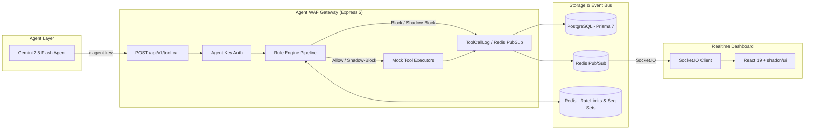

# Implementation Plan: Agent WAF (Policy-Enforcing AI Proxy)

Build a production-grade Web Application Firewall (WAF) for AI agent tool calls. It intercepts, validates, rate-limits, inspects, and logs tool calls in real time with a live dashboard, Gemini agent integration, and AWS deployment readiness.

## User Review Required

> [!IMPORTANT]
> The project will proceed in strict phases, pausing at each **CHECKPOINT** for your explicit review and verification before proceeding to the next phase:
>
> - **Checkpoint 1**: Monorepo scaffolding, `AGENTS.md`, Prisma 7 + PostgreSQL & Redis Docker setup, Express 5 server with `/healthz` & `/api/version`.
> - **Checkpoint 2**: Rule engine (RATE_LIMIT, PARAM_BLOCKLIST, PARAM_SIZE_LIMIT, DATA_SCOPE, SEQUENCE), mock tools, gateway endpoint `POST /api/v1/tool-call`, vitest test suite, and blocked curl transcripts.
> - **Checkpoint 3**: Gemini Agent integration (`@google/genai`), agentic tool-calling loop, CLI/REST runner, canned demo scenarios.
> - **Checkpoint 4**: React 19 + Vite + Tailwind + shadcn/ui dashboard, better-auth email/password + Quick Login, live Socket.IO feed, rule & agent management, stats charts, seed data.
> - **Checkpoint 5 (Shadow Mode + AWS Deploy)**: Shadow mode evaluation & UI toggle, multi-stage Dockerfiles, `docker-compose.prod.yml`, GitHub Actions workflow, and `DEPLOY.md` AWS guide.

---

## Phase Breakdown & Architecture

---

## Proposed Changes

### Phase 1: Foundation & Scaffold (Targeting Checkpoint 1)

#### [NEW] [AGENTS.md](file:///c:/aivar/AGENTS.md)

Standing rules and architectural constraints for the monorepo workspace.

#### [NEW] [pnpm-workspace.yaml](file:///c:/aivar/pnpm-workspace.yaml)

Workspace configuration containing `apps/*` and `packages/*`.

#### [NEW] [packages/shared-types](file:///c:/aivar/packages/shared-types)

Shared TypeScript types, Zod schemas, rule definitions, and API contracts.

#### [NEW] [apps/backend](file:///c:/aivar/apps/backend)

- `package.json` (`"type": "module"`, scripts for dev/build/test/migrate/seed)
- `tsconfig.json` (`ESNext`, `bundler`, `strict: true`)
- `docker-compose.dev.yml` (PostgreSQL 16 & Redis 7 for local dev)
- `prisma.config.ts` (Prisma 7 ESM config)
- `prisma/schema.prisma` (Agent, AgentSession, Rule, ToolCallLog, Customer, better-auth models)
- `src/lib/prisma.ts` (`PrismaPg` adapter + `PrismaClient`)
- `src/lib/redis.ts` (`ioredis` client)
- `src/lib/logger.ts` (`pino` JSON structured logger)
- `src/index.ts` (Express 5 app with `/healthz`, `/api/version`, helmet, cors, Pino logger middleware)

---

### Phase 2: Rule Engine & Tool Gateway (Targeting Checkpoint 2)

- Implement pure mock tools: `get_customer_record`, `update_customer_record`, `delete_customer_record`, `send_email`, `execute_report_query`, `export_report`.
- Rule Evaluators for `RATE_LIMIT` (Redis atomic INCR+EXPIRE), `PARAM_BLOCKLIST` (regex pattern matching with sanitization), `PARAM_SIZE_LIMIT`, `DATA_SCOPE` (regex against agent declaredScope), and `SEQUENCE` (Redis set lookup).
- Express endpoint `POST /api/v1/tool-call` with agent key validation, rule pipeline execution, tool invocation, sanitization, ToolCallLog persistence, and Redis pub/sub broadcast.
- Unit and integration tests with Vitest covering every rule type and shadow mode.

---

### Phase 3: Gemini Agent Integration (Targeting Checkpoint 3)

- Gemini integration via `@google/genai` (SDK model `gemini-2.5-flash` or from `GEMINI_MODEL`).
- Mock tool declarations mapped to Gemini FunctionDeclarations.
- Agentic loop: prompt -> functionCall -> POST to WAF Gateway -> feed result/denial reason back -> final answer.
- CLI runner `pnpm demo:agent` and REST endpoint `POST /api/v1/agent-run`.
- Demo script `scripts/demo-scenarios.ts` with canned goals to trigger each rule.

---

### Phase 4: Frontend Dashboard (Targeting Checkpoint 4)

- React 19 + Vite + Tailwind + shadcn/ui.
- Better-auth setup with Email/Password and Quick Demo Login.
- Live event stream via Socket.IO `/dashboard` namespace with color-coded dispositions.
- Live metrics and charts (recharts/shadcn charts).
- Rules management interface (toggle enable, toggle BLOCK/SHADOW, create rule modal).
- Agent management interface (API key generator modal with copy-once token).
- Logs explorer with filtering, pagination, and rule evaluation breakdown drawer.
- Database seed script (`seed.ts`) for admin user, demo agent, default rules, and customer records.

---

### Phase 5 & 6: Shadow Mode & Production AWS Dockerization (Targeting Checkpoint 5)

- Dedicated Shadow Activity panel and calibration workflow.
- Multi-stage `apps/backend/Dockerfile` and `apps/frontend/Dockerfile` with Nginx reverse proxy.
- `docker-compose.prod.yml` orchestrating postgres, redis, backend, and frontend.
- GitHub Actions CI workflow (`.github/workflows/ci.yml`).
- `DEPLOY.md` with step-by-step AWS EC2 t3.micro provisioning, security group rules, Elastic IP, and deployment commands.

---

## Verification Plan

### Checkpoint 1 Automated & Manual Tests

1. Verify `docker-compose.dev.yml` brings up PostgreSQL & Redis cleanly.
2. Run `prisma migrate dev` with Prisma 7 to verify schema & client generation.
3. Start backend with `tsx src/index.ts`.
4. Run `curl http://localhost:4000/healthz` -> ensure HTTP 200 `{"status":"ok","postgres":"connected","redis":"connected"}`.
5. Run `curl http://localhost:4000/api/version` -> ensure commit/version metadata returns.
6. Present Checkpoint 1 summary and await user approval before proceeding to Phase 2.
